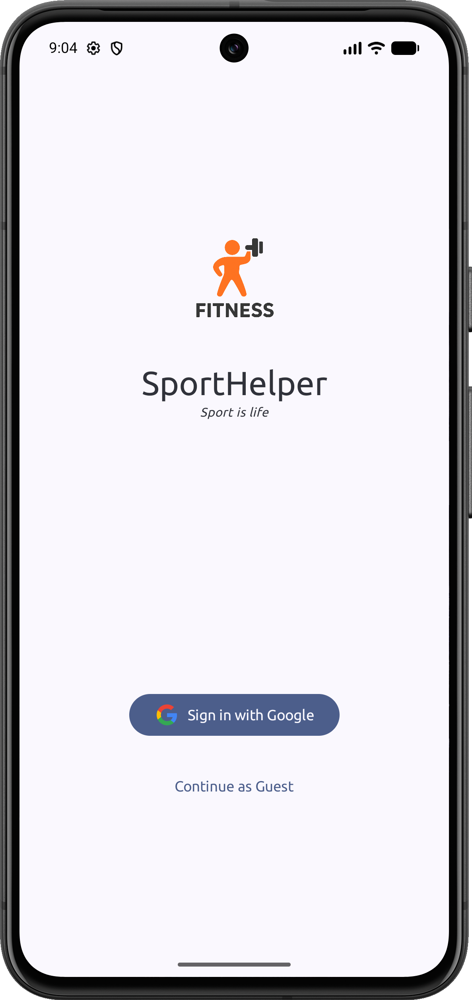
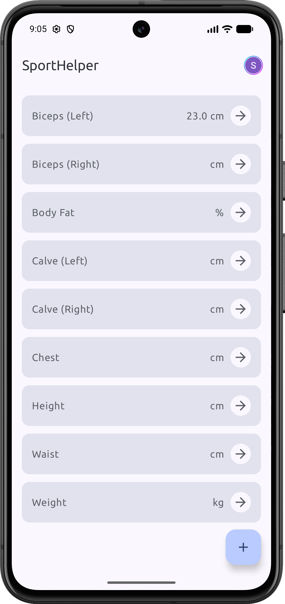
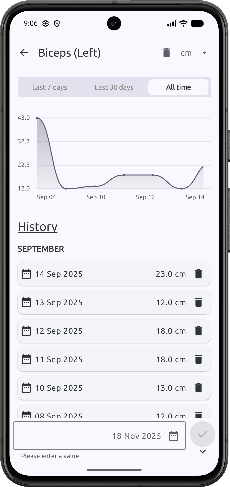

# 🏋️ SportHelper

<div align="center">

A modern **Android application** for tracking body measurements and fitness progress, built with
Jetpack Compose and following clean architecture principles.

[](http://kotlinlang.org)
[](https://developer.android.com/jetpack/compose)
[](https://firebase.google.com/)
[](LICENSE)

</div>

## ✨ Features

- 📊 **Body Measurements Tracking** - Monitor various body parts (weight, height, waist, biceps,
  chest, etc.)
- 🔐 **Firebase Authentication** - Secure Google Sign-In integration
- ☁️ **Cloud Sync** - Data stored in Firebase Firestore for seamless access across devices
- 🎨 **Modern UI** - Beautiful Material 3 design with Jetpack Compose
- 📱 **Responsive Layout** - Adaptive design for different screen sizes
- 🌙 **Dark Theme Support** - Comfortable viewing in any lighting condition
- 📈 **Progress History** - View your measurement history and track changes over time
- 💾 **Persistent Data** - Never lose your fitness journey data

## 📸 Screenshots

<div align="center">
<!-- Add your screenshots here -->
<!--  -->
<!--  -->
<!--  -->
</div>

## 🏗️ Architecture

This project follows **MVVM + Clean Architecture** principles with clear separation of concerns:

```
├── presentation/     # UI Layer (Compose UI, ViewModels)
│   ├── signin/      # Authentication screen
│   ├── dashboard/   # Main dashboard
│   ├── add_item/    # Add measurement screen
│   ├── details/     # Measurement details
│   └── theme/       # App theming
├── domain/          # Business Logic (Models, Repository Interfaces)
├── data/            # Data Layer (Repositories, Mappers)
│   ├── mapper/     # Data mappers
│   └── repository/ # Repository implementations
└── di/             # Dependency Injection (Hilt)
```

## 🛠️ Tech Stack

### Core Technologies

- **[Kotlin](https://kotlinlang.org/)** - Modern programming language for Android
- **[Jetpack Compose](https://developer.android.com/jetpack/compose)** - Modern declarative UI
  framework
- **[Material Design 3](https://m3.material.io/)** - Latest Material Design components

### Libraries & Frameworks

| Library | Purpose | Version |
|---------|---------|---------|
| [Jetpack Compose](https://developer.android.com/jetpack/compose) | Declarative UI framework | 2024.09.02 |
| [Dagger Hilt](https://dagger.dev/hilt/) | Dependency injection | 2.56.2 |
| [Firebase Auth](https://firebase.google.com/products/auth) | Authentication | 34.2.0 |
| [Firebase Firestore](https://firebase.google.com/products/firestore) | Cloud database | 34.2.0 |
| [Navigation Compose](https://developer.android.com/jetpack/compose/navigation) | In-app navigation | 2.9.3 |
| [Coil](https://coil-kt.github.io/coil/) | Image loading | 3.0.0 |
| [Kotlinx Serialization](https://github.com/Kotlin/kotlinx.serialization) | JSON parsing | 1.7.2 |
| [Credentials API](https://developer.android.com/training/sign-in/passkeys) | Credential management | 1.6.0-alpha05 |
| [Core Splashscreen](https://developer.android.com/develop/ui/views/launch/splash-screen) | Splash screen | 1.0.1 |

## 📋 Tracked Measurements

The app allows tracking of the following body metrics:

- **Weight** (kg)
- **Height** (cm)
- **Body Fat** (%)
- **Waist** (cm)
- **Chest** (cm)
- **Biceps** - Left & Right (cm)
- **Triceps** - Left & Right (cm)
- **Shoulders** (cm)
- **Hips** (cm)
- **Thighs** - Left & Right (cm)
- **Calves** - Left & Right (cm)

## 🚀 Getting Started

### Prerequisites

- **Android Studio** Ladybug or later (2024.2.1+)
- **JDK** 11 or higher
- **Kotlin** 2.0.0
- **Android SDK** with API level 23+ (Android 6.0+)

### Installation

1. **Clone the repository**
   ```bash
   git clone https://github.com/yourusername/SportHelper.git
   cd SportHelper
   ```

2. **Open in Android Studio**
    - Open Android Studio
    - Select "Open an Existing Project"
    - Navigate to the cloned directory

3. **Configure Firebase**
    - Create a Firebase project in [Firebase Console](https://console.firebase.google.com/)
    - Enable Firebase Authentication with Google Sign-In provider
    - Enable Cloud Firestore
    - Download `google-services.json` file
    - Place it in the `app/` directory

4. **Run the app**
    - Select your device/emulator
    - Click Run ▶️

### Configuration

Create a `local.properties` file in the root directory if it doesn't exist:

```properties
sdk.dir=YOUR_ANDROID_SDK_PATH
```

## 📱 Requirements

| Requirement | Version |
|-------------|---------|
| **Minimum SDK** | API 23 (Android 6.0) |
| **Target SDK** | API 34 (Android 14) |
| **Compile SDK** | API 35 |

## 🏛️ Project Structure

```
SportHelper/
├── app/
│   ├── src/
│   │   └── main/
│   │       └── java/com/example/sporthelper/
│   │           ├── data/              # Data layer
│   │           │   ├── mapper/       # Data mappers
│   │           │   └── repository/   # Repository implementations
│   │           ├── domain/            # Domain layer
│   │           │   ├── model/        # Domain models
│   │           │   └── repository/   # Repository interfaces
│   │           ├── presentation/      # UI layer
│   │           │   ├── signin/       # Authentication screen
│   │           │   ├── dashboard/    # Main dashboard
│   │           │   ├── add_item/     # Add measurement screen
│   │           │   ├── details/      # Measurement details
│   │           │   └── theme/        # App theming
│   │           └── di/               # Dependency injection
│   ├── build.gradle.kts
│   └── google-services.json          # Firebase config (add this)
├── gradle/                            # Gradle wrapper
└── build.gradle.kts                   # Root build file
```

## 🎯 Key Features Implementation

### 🔐 Authentication (Firebase Auth)

- Google Sign-In integration
- Secure credential management
- Persistent user sessions
- Automatic token refresh

### ☁️ Cloud Sync (Firestore)

- Real-time data synchronization
- Offline data persistence
- Efficient data queries
- User-specific data isolation

### 🎨 UI/UX (Jetpack Compose)

- Declarative UI components
- Material 3 theming
- Responsive layouts
- Smooth animations and transitions

### 💉 Dependency Injection (Hilt)

- Modular DI setup
- ViewModel injection
- Repository pattern implementation
- Lifecycle-aware components

## 🔑 Firebase Configuration

To run this app, you need to:

1. **Create a Firebase project** at [Firebase Console](https://console.firebase.google.com/)
2. **Enable Firebase Authentication**
    - Go to Authentication → Sign-in method
    - Enable Google Sign-In provider
    - Add your SHA-1 and SHA-256 fingerprints
3. **Enable Cloud Firestore**
    - Go to Firestore Database
    - Create database in production mode
    - Set up security rules
4. **Download configuration**
    - Download `google-services.json`
    - Place it in the `app/` directory

### Security Rules (Firestore)

```javascript
rules_version = '2';
service cloud.firestore {
  match /databases/{database}/documents {
    match /users/{userId}/{document=**} {
      allow read, write: if request.auth != null && request.auth.uid == userId;
    }
  }
}
```

## 🧪 Testing

```bash
# Run unit tests
./gradlew test

# Run instrumented tests
./gradlew connectedAndroidTest

# Run all tests
./gradlew testDebugUnitTest connectedAndroidTest
```

## 📦 Build

### Debug Build

```bash
./gradlew assembleDebug
```

### Release Build

```bash
./gradlew assembleRelease
```

The APK will be generated in `app/build/outputs/apk/release/`

## 🤝 Contributing

Contributions are welcome! Please feel free to submit a Pull Request.

For major changes, please open an issue first to discuss what you would like to change.

1. Fork the Project
2. Create your Feature Branch (`git checkout -b feature/AmazingFeature`)
3. Commit your Changes (`git commit -m 'Add some AmazingFeature'`)
4. Push to the Branch (`git push origin feature/AmazingFeature`)
5. Open a Pull Request

## 🐛 Known Issues

- None at the moment

## 🗺️ Roadmap

- [ ] Charts and graphs for progress visualization
- [ ] Export data to CSV/PDF
- [ ] Custom measurement types
- [ ] Multi-language support
- [ ] Widget support
- [ ] Reminders and notifications
- [ ] Photo progress tracking
- [ ] Social sharing features

## 📝 License

This project is for educational and personal use.

## 🙏 Acknowledgments

- [Google](https://www.google.com/) for Firebase and Android ecosystem
- [JetBrains](https://www.jetbrains.com/) for Kotlin
- The amazing Android development community

## 📚 Resources

- [Android Developers](https://developer.android.com/)
- [Jetpack Compose Documentation](https://developer.android.com/jetpack/compose)
- [Firebase Documentation](https://firebase.google.com/docs)
- [Material Design 3](https://m3.material.io/)
- [Kotlin Documentation](https://kotlinlang.org/docs/home.html)


<div align="center">

Made with ❤️ using Jetpack Compose

</div>
